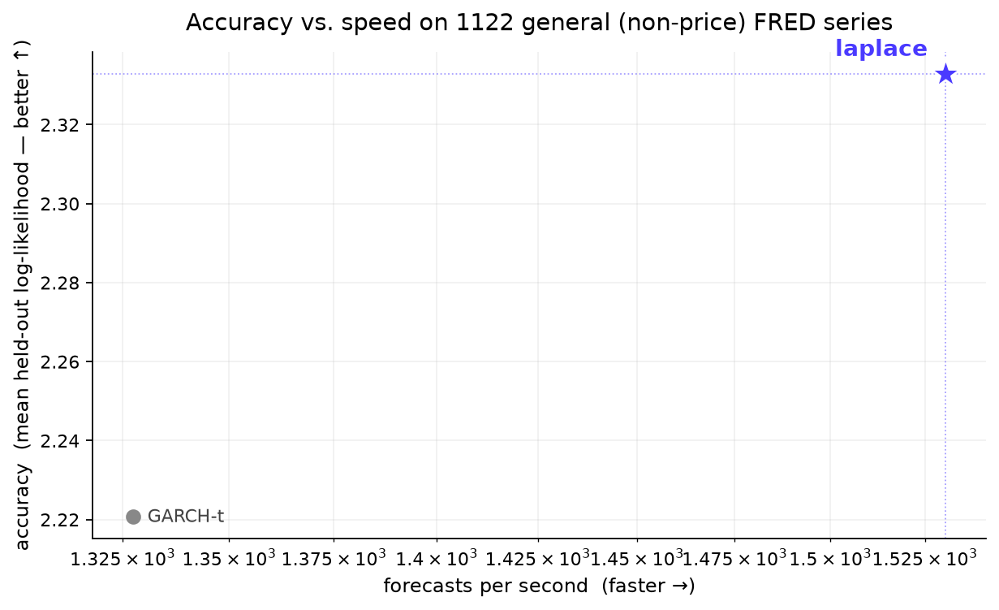

# skaters ([demo](https://skaters.microprediction.org/demos/playground.html))

One univariate time-series model to rule them all? For non-price economic series, near enough and you can watch *Laplace* [here](https://skaters.microprediction.org/demos/playground.html).


<p align="center">
  <a href="https://skaters.microprediction.org/"></a>
  <a href="#javascript--the-browser"></a>
</p>

Laplace beats everything.

<p align="center">
  
</p>


Laplace is fast, dependency-free, **online** univariate *distributional* forecasting in **Python _and_ JavaScript** (identical to 1e-6, browser-ready via [Pyodide](https://skaters.microprediction.org/demos/pyodide.html)). It's a **general-purpose forecaster for non-price economic series**: across ~900 such FRED series *Laplace* has the highest mean held-out **log-likelihood** and the best per-series win-rate against every baseline — AutoARIMA, AutoETS, SARIMAX, conformal, zero-shot foundation models, **and GARCH-t** (68% / 65% family-weighted). 

**Not for price/return series:** 
We recomment GARCH-t there instead. 

**Not really for CRPS targets**
On CRPS Laplace still beats most of the competition. However if you really like CRPS you should pick a method like
conformal prediction. This comes with the warning that the CRPS goalpost is not suited for things like growing your wealth. 


## Install

```bash
pip install skaters
```

## Quick start

```python
from skaters import laplace

f = laplace(k=3)
state = None
for y in observations:
    dists, state = f(y, state)
    dists[0].mean              # point forecast
    dists[0].std               # uncertainty
    dists[0].quantile(0.975)   # 95th percentile
    dists[0].logpdf(y)         # log-likelihood
    dists[0].cdf(y)            # CDF at y
```

Every skater returns `list[Dist]` — a weighted Gaussian mixture for each horizon $h = 1, \ldots, k$. Point forecasts, uncertainty, density evaluation, and quantiles are all aspects of the same object.

## `laplace` — the one forecaster

`skaters` exposes **exactly one forecaster**, `laplace`. Everything else is a
building block (transforms, leaves, ensembles) you can compose. ("skater" is the
*concept* — any `(y, state) -> ([Dist], state)` function, borrowed from the old
timemachines package.)

```python
from skaters import laplace

f = laplace(k=1)
```

A likelihood-weighted Bayesian ensemble over a large candidate population (EMA,
differencing, drift, Holt, AR, fractional differencing, seasonal, a Yeo-Johnson
**coordinate** grid, a fast/slow two-systems block, and — at multi-step horizons
(`k>1`) — an **Ornstein–Uhlenbeck mean-reversion** group). Three things are on by
default, each a free or near-free win:

- **model first, conform last** — the trunk is weighted by **likelihood** (honest
  modelling); the terminal leaf is fit by **CRPS** (`objective="crps"`). On a
  2,500-series FRED study this matches a CRPS specialist on CRPS *and* lifts
  likelihood on real data. Switch back with `objective="likelihood"`.
- **lattice projection** (`sticky=True`) — near-Dirac atoms on the exact values a
  series revisits. *Free* on continuous data (it vanishes), a large win on
  grid/repeating series (policy rates, posted prices).
- **coordinate learning** — a Yeo-Johnson λ-grid lets the ensemble learn whether
  the series is simple in a log/multiplicative, sqrt, or linear coordinate.

```python
f = laplace(k=1)                          # CRPS leaf + lattice, both on
f = laplace(k=1, objective="likelihood")  # pure-likelihood leaf
f = laplace(k=1, sticky=False)            # no lattice projection
```

**Price/return series** (`garch_leaf`). The default terminal leaf tracks its scale
with an EWMA (RiskMetrics/IGARCH — no variance mean-reversion). For series with
volatility *clustering and reversion* (equity/fx/commodity returns), swap in a
GARCH(1,1)-t terminal leaf:

```python
from skaters import laplace, garch_leaf
f = laplace(k=1, leaf=garch_leaf)         # GARCH(1,1) conditional variance + Student-t tails
```

**Not for price/returns, though** — there a fitted GARCH-t still wins

### Specialist behaviour by composition

There's only one forecaster, but the building blocks compose into specialists when
you have a strong prior. **Mean reversion** (e.g. pairs-trading spreads): the
`ou_transform` reverts to a running mean and its edge grows with the horizon, so
feed it `k>1` —

```python
from skaters.conjugate import conjugate
from skaters.leaf import leaf
from skaters.transform import ou_transform, yeo_johnson

f = conjugate(leaf(k=10), ou_transform(kappa=0.1), k=10)                       # linear (spreads)
f = conjugate(conjugate(leaf(k=10), ou_transform(0.1), k=10), yeo_johnson(0.5), k=10)  # positive (vol/rates)
```

`laplace(k>1)` already carries an OU group in its pool, so the general forecaster
picks up reversion automatically at multi-step horizons. The OU-on-a-coordinate
math (the CIR reading) is in [`papers/tweedie-note.md`](papers/tweedie-note.md).

## Architecture

Everything is transforms all the way down, with a distributional leaf at the bottom:

$$y \;\xrightarrow{T_1}\; y' \;\xrightarrow{T_2}\; y'' \;\xrightarrow{\cdots}\; \text{leaf} \;\rightarrow\; \hat{D}$$

The leaf estimates $\hat{D} = \mathcal{N}(0, \hat\sigma^2)$ from residuals via Welford's algorithm. The prediction in the original space is obtained by inverting the transform chain:

$$\hat{D}_{\text{original}} = T_1^{-1}\bigl(T_2^{-1}\bigl(\cdots\bigl(\hat{D}\bigr)\bigr)\bigr)$$

Every node returns `list[Dist]`. There is no separate "point forecast" vs "uncertainty" — both are aspects of the same $\hat{D}$.

### The key insight

Every "model" is really a transform. An EMA doesn't "predict" — it subtracts a running level $\ell_t$, leaving simpler residuals $\varepsilon_t = y_t - \ell_t$. The prediction comes from inverting the transform chain applied to the leaf's distributional estimate.

## The Dist type

A weighted mixture of Gaussians $\sum_{i} w_i \,\mathcal{N}(\mu_i, \sigma_i^2)$. Pure Python (`math.erf`, `math.exp`).

```python
from skaters import Dist

d = Dist.gaussian(5.0, 2.0)
d.mean                  # 5.0
d.std                   # 2.0
d.pdf(5.0)              # density at x
d.cdf(3.0)              # P(X <= 3)
d.logpdf(5.0)           # log-likelihood
d.quantile(0.975)       # inverse CDF

# Exact mixture combination (for ensembles)
mix = Dist.combine([d1, d2, d3], weights=[0.5, 0.3, 0.2])

# Propagate through transform inverses
d.shift(10.0)           # translate: mu -> mu + 10
d.scale(2.0)            # scale: mu -> 2*mu, sigma -> 2*sigma
d.affine(2.0, 3.0)      # x -> 2x + 3

# Bound component growth
d.prune(max_components=10)
```

## Transforms

Online bijective maps. Each has a `forward` (scalar in, scalar out) and an `inverse_k` that propagates $\text{Dist}$ objects back through the inverse.

| Transform | Forward | Inverse | Use case |
|-----------|---------|---------|----------|
| `ema_transform(`$\alpha$`)` | $y'_t = y_t - \ell_t$ | $D \mapsto D + \ell_t$ | Remove level |
| `difference()` | $y'_t = y_t - y_{t-1}$ | Cumsum with $\text{Var}$ growing as $\sum \sigma_h^2$ | Random walk |
| `drift(`$\alpha, \lambda$`)` | $y'_t = \Delta y_t - \hat\mu_t$ | $y_t + h\hat\mu + \sum\varepsilon$ | Random walk + drift |
| `holt_linear(`$\alpha, \beta$`)` | $y'_t = y_t - (\ell_t + b_t)$ | $\ell_t + h \cdot b_t + \varepsilon$ | Level + trend (Holt 1957) |
| `ar(`$p$`)` | $y'_t = y_t - \sum \hat\phi_j y_{t-j}$ | AR reconstruction with variance propagation | Autoregression (online RLS) |
| `grouped_ar(`$L$`)` | Same, grouped coefficients | Same | Long-lag AR with $O(\log L)$ params |
| `fractional_difference(`$d$`)` | $y'_t = (1-B)^d \, y_t$ | $(1-B)^{-d}$ | Long memory |
| `standardize(`$\alpha$`)` | $y'_t = (y_t - \hat\mu_t) / \hat\sigma_t$ | $D \mapsto \hat\sigma_t \cdot D + \hat\mu_t$ | Remove scale |
| `garch(`$\omega, \alpha, \beta$`)` | $y'_t = y_t / \hat\sigma_t$ | $D \mapsto \hat\sigma_t \cdot D$ | Volatility clustering |
| `seasonal_difference(`$s$`)` | $y'_t = y_t - y_{t-s}$ | Shift by lagged value | Periodicity |
| `power_transform(`$p$`)` | $y'_t = \text{sign}(y_t)\|y_t\|^p$ | Delta method | Tail compression |

## Conjugation

Transforms compose via conjugation. Given a transform $T$ and a skater $f$:

$$f_{\text{conjugated}}(y) = T^{-1}\!\bigl(f\bigl(T(y)\bigr)\bigr)$$

The pipe `|` notation reads left-to-right (outermost transform first):

```python
from skaters import conjugate, ema, difference, standardize

# diff removes trend, EMA predicts the differenced series
f = conjugate(ema(alpha=0.1, k=3), difference(), k=3)

# Chain: standardize, then difference, then EMA
f = conjugate(
    conjugate(ema(alpha=0.1, k=3), difference(), k=3),
    standardize(),
    k=3,
)
# canonical name: std|diff|ema_t|leaf
```

## Ensembles

### Precision-weighted (MSE)

Weights by $w_i \propto 1/\text{MSE}_i$ where $\text{MSE} = \text{bias}^2 + \text{variance}$.

```python
from skaters import precision_weighted_ensemble, ema

f = precision_weighted_ensemble([
    ema(alpha=0.05, k=1),
    ema(alpha=0.2, k=1),
], k=1)
```

### Bayesian (log-likelihood, XGBoost-inspired regularization)

Each model $i$ accumulates a log-weight updated at every observation:

$$\log w_i \;\mathrel{+}=\; \eta \cdot \log p_i(y_t) \;-\; \lambda \cdot d_i$$

where $\eta$ is the learning rate (shrinkage), $\lambda$ is the complexity penalty, and $d_i$ is the model's depth. Predictions are combined via $\text{Dist.combine}$ with softmax weights.

```python
from skaters import bayesian_ensemble, ema

f = bayesian_ensemble(
    [ema(alpha=0.05, k=1), ema(alpha=0.2, k=1)],
    k=1,
    learning_rate=0.5,       # eta: prevents over-concentrating
    complexity_penalty=0.02, # lambda: penalizes deeper chains
    depths=[1, 1],
)
```

### Adaptive search (beam search over transform grammar)

Grows the candidate population online: expand top performers with new transforms, replay recent history to warm-start, prune losers.

```python
from skaters import search

f = search(
    k=1,
    expand_interval=100,  # expand top performers every 100 obs
    max_depth=3,          # maximum transform chain depth
    replay_buffer=500,    # warm-start new candidates on recent history
    max_pool=30,          # cap active candidates
)
```

## Heavy tails: the scale-mixture leaf

Everything here is judged by predictive **log-likelihood**. A plain Gaussian leaf
gets the *location* and *scale* right but the *shape* wrong on heavy-tailed
residuals (returns, macro data), and — crucially — Bayesian model averaging
preserves the mean and variance but **washes the kurtosis out**, so adding heavy
leaves to the candidate pool doesn't help.

The fix is the **scale-mixture leaf**: a fixed dictionary of zero-mean Gaussians
`N(0, aᵢ·σ)` with weights learned online (a Student-t *is* a Gaussian scale
mixture, so this approximates it). It's a plain `Dist`; the weights are the
"discrepancy from N(0,1)" — all on `a=1` is Gaussian, mass on larger `a` is fat
tails. It matches the Gaussian leaf on Gaussian data and beats it as tails fatten.

```python
from skaters import scale_mixture_leaf, terminal_leaf_ensemble, leaf
```

Because mixing washes out shape, the named policies use a **terminal-leaf
ensemble**: the candidates are combined for the *mean*, then one terminal
scale-mixture leaf models the combined residual — so the leaf's shape reaches the
output undiluted. On Student-t₃ this takes `laplace` from a logpdf of ≈ −2.07
(Gaussian-collapsed) to ≈ −1.93, with no cost on Gaussian data.

`Dist.crps(y)` (closed-form CRPS) is also available as a proper score for
benchmarking.

## Spec system

Serialize and rebuild any pipeline:

```python
from skaters import (
    build, spec_name, to_json, from_json,
    ema_spec, conjugate_spec, ensemble_spec, diff_spec,
)

spec = ensemble_spec(
    conjugate_spec(ema_spec(0.1, k=1), diff_spec()),
    ema_spec(0.3, k=1),
    k=1,
)

spec_name(spec)     # "ensemble(diff|ema(0.1),ema(0.3))"
j = to_json(spec)   # JSON string
f = build(from_json(j))  # live skater
```

## Writing a custom transform

Any $(T, T^{-1})$ pair where `forward` is scalar and `inverse_k` maps `list[Dist]`:

```python
def my_transform():
    def forward(y, state):
        if state is None:
            return 0.0, {"anchor": y}
        transformed = y - state["anchor"]
        return transformed, {"anchor": y}

    def inverse_k(dists, state):
        return [d.shift(state["anchor"]) for d in dists]

    return forward, inverse_k
```

## JavaScript & the browser

The whole library is also a zero-dependency **JavaScript port** (`docs/js/skaters/`) — every
transform, ensemble, and named policy. It is verified against the Python reference by a parity
suite that checks 76,000+ values to 1e-6 (`parity/`, run in the test suite via
`tests/test_js_parity.py`).

```html
<script type="module">
  import { laplace } from "https://skaters.microprediction.org/js/skaters/index.mjs";
  const f = laplace(1);
  let state = null;
  for (const y of observations) {
    const [dists, st] = f(y, state); state = st;
    dists[0].mean;            // point forecast
    dists[0].quantile(0.975); // 97.5th percentile
  }
</script>
```

Interactive demos (forecasting playground in native JS, and the real Python package running in
[Pyodide](https://pyodide.org/)) live at
[skaters.microprediction.org/demos](https://skaters.microprediction.org/demos/).

## Design

- **Online only** — $O(1)$ per observation, no batch recomputation
- **Distributional** — every prediction is a $\text{Dist}$, not a point estimate
- **Composable** — transforms chain, ensembles nest, everything returns $\text{Dist}$
- **Pure Python** — zero dependencies, only `math.erf` and `math.exp`
- **Pyodide compatible** — works in the browser via WebAssembly

## Theoretical context

The online recursions here are **score-driven updates** with a Bayesian reading.
The EMA level update $\mu_t = \mu_{t-1} + \alpha\,(y_t - \mu_{t-1})$ and the GARCH
variance update $h_t = h_{t-1} + (1-\delta)(y_t^2 - h_{t-1})$ — the `ema_transform`
and `garch`/`garch_leaf` building blocks — are both inverse-Fisher-scaled
conditional-score corrections. Via **Tweedie's formula**, Hansen & Tong (2026,
[arXiv:2605.15902](https://arxiv.org/abs/2605.15902)) show these are the *exact*
Bayesian posterior-mean corrections under a conjugate prior with local precision
discounting (with the smoothing factor identified as $\alpha = 1-\delta$, the
Gaussian-location case recovering the Kalman filter), and tractable local
approximations otherwise. So the volatility transforms are (approximate) Bayesian
filters rather than ad-hoc heuristics. See also Creal, Koopman & Lucas (2013) and
Harvey (2013) for the score-driven / GAS framework.

The same identity is the backbone of modern **denoising / score-based diffusion
models**: the posterior mean of a clean signal given a noisy observation is
"observation $+\ \sigma^2 \times$ score of the marginal density," which is what
lets a diffusion denoiser be read as a score estimator (Efron 2011; Vincent 2011;
Song & Ermon 2019). Each forecast step here is the time-series analogue —
denoising the next observation toward the latent level or variance. A short essay
on this — Kalman, empirical Bayes, and diffusion as one identity — is in
[`papers/tweedie-note.md`](papers/tweedie-note.md).

## Lineage

This package distills ideas from timemachines, which provided a common skater interface for dozens of time series packages. This is a from-scratch rewrite focused on speed, distributional predictions, and browser compatibility.
