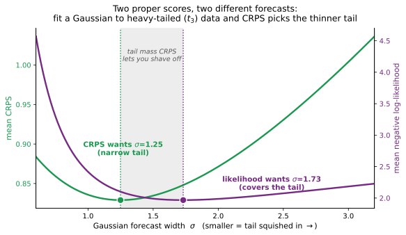

# Why skaters ranks by likelihood, by default

*A minor but novel contribution to an age-old debate, emphasizing chained elicitation of probabilities.*

## Choosing the target

A scoring rule is not a metaphysical definition of "good forecasting." It is a settlement rule: it says what the forecaster is being paid to produce. So the first question is not "likelihood or CRPS?" It is: *what object is the user asking for?*

If the user wants a threshold probability, score threshold probabilities. Quantiles, score quantiles. Intervals, score intervals. A trading action, score the action or the P&L it induces. A full density for later reuse, score the density. This is the standard counsel of the scoring-rule literature: evaluate the forecast against the functional it is meant to be, or the comparison is incoherent (Gneiting & Raftery, 2007; Gneiting, 2011).

That last case is the `skaters` default, and it is a deliberate choice. A density forecast is a portable object: it can be used later for pricing, simulation, Bayesian updating, risk limits, threshold alarms, portfolio sizing, tail estimation, or further refinement by another forecaster. When the future use is not known in advance, the right default is to reward the object that preserves the most reusable probabilistic information. That is why `skaters` ranks density forecasts by held-out log-likelihood $\log q(y)$.

None of this pretends a univariate density is the whole job. Real time-series are driven by exogenous data, and any serious model has to bring that in. So univariate distributional prediction is a component rather than a pipeline: it plugs in before, during, or after other modeling. `skaters` is built that way by construction. A skater *is* a transformation, a chain of invertible maps over a single distributional leaf, so it composes into a larger workflow instead of standing alone. That is the same property the rest of this note turns on, and the reason the score has to make the pieces compose.

## Why likelihood is the default density target

The log-versus-CRPS debate is an old one, usually settled on the grounds already rehearsed here: locality, propriety, robustness, interpretability. `skaters` presses a different consideration, one this debate rarely weighs, because chaining has been integral to the microprediction vision from the start. That program never pictured a single model emitting a forecast. It pictured a stream of participants, each refining the residual the last one left behind, a supermind assembled from small contributions ([Cotton, *Microprediction: Building an Open AI Network*, MIT Press, 2022](https://book.microprediction.org/)). A score fit for that has to make refinements *compose*. That consideration seldom enters the log-versus-CRPS discussion, and it is the one `skaters` turns on.

The usual case rests on propriety, and propriety is shared: CRPS is proper too. The reason that gets less attention is that *likelihood is the score under which density refinements compose*.

Suppose a base forecast has density $p_1(y)$ and CDF $F_1$. A second-stage forecaster can forecast the residualized variable $z = \Phi^{-1}(F_1(y))$. If the residual density is $g(z)$, the composed density is $p(y) = p_1(y)\,g(z)/\varphi(z)$, so

$$\log p(y) = \log p_1(y) + \big(\log g(z) - \log\varphi(z)\big).$$

The log score of the composed forecast is the base score plus the incremental score of the refinement. Skill can be attributed stage by stage. A residual market can pay the forecaster who finds structure the base market left behind, and a sequence of such markets is a decentralized boosting machine ([Multi-Stage Solicitation](https://mechanisms.microprediction.org/papers/multi-stage-solicitation.html)). CRPS does not factor through this residual-density multiplication in the same way. It is a valuable CDF and threshold diagnostic, but not the same accounting system for chained density improvement.

Two properties support the default. The log score is *local*. It reads only the density at the realized $y$, the number a likelihood ratio, a Bayesian update, or a Kelly bet actually consumes. Among scores that depend only on that density value, it is essentially unique up to an affine change (Bernardo, 1979). Broader *derivative*-local scores exist (Parry, Dawid & Lauritzen, 2012), but they no longer ask only "what density did you put on what happened?" And it is *information-theoretic*. Its regret against the truth is the Kullback–Leibler divergence, so the value a conditioning forecaster extracts from a covariate the crowd ignored is exactly the mutual information $I(R;X)$ ([Betting Against a Conformal Predictor](https://conformalprediction.net/papers/parimutuel/)). Both are properties a reusable density ought to be rewarded for.

## It is what a market pays

There is a market reading of the same fact, and it is foundational quantitative finance rather than metaphor. Every financial market is a bet on an uncertain outcome whose prices behave like a distribution. In a complete, arbitrage-free market, normalized Arrow–Debreu state prices define a *risk-neutral* state-price density. In an incomplete market there may be many, and none need equal the physical law (Cochrane, 2005). The growth-optimal (Kelly) investor, for her part, stakes her *physical* probabilities, maximizing $\mathbb{E}[\log q(Y)]$. A parimutuel that splits its pot in proportion to the density each participant placed on the outcome is the bare version: per unit of staked wealth it pays $q(y)$ relative to the field. An options book, a prediction market, and the nearest-the-pin pool are the same machine in different clothes ([mechanisms.microprediction.org](https://mechanisms.microprediction.org)). So log-likelihood is the settlement rule of a density-ratio market. CRPS has useful threshold and CDF readings, but it is not that settlement rule: it does not give the same multiplicative refinement and additive credit accounting that likelihood gives.

## Two geometries of error

The cleanest way to see when each score is right is to look at what its regret measures:

$$\text{log-score regret} = D_{\mathrm{KL}}(p \,\|\, q), \qquad \text{CRPS regret} = \int_{-\infty}^{\infty}\big(F_q(t) - F_p(t)\big)^2\,dt.$$

Log score penalizes relative density error where the truth puts its mass. It asks, "did you assign enough density to the state that actually occurred?" CRPS penalizes integrated CDF error across thresholds. These correspond to different future-use assumptions. If the downstream use may involve likelihood ratios, Bayesian updating, sequential composition, Kelly sizing, or sharp conditional bets, log score is the more faithful general-purpose density score. If the use is coarse (a threshold, a quantile, an inventory or risk limit, a smooth payoff integral), CRPS can be more decision-relevant, because a forecast can have a slightly ugly density but very good threshold probabilities, and CRPS will rank it accordingly.

## A worked example: CRPS picks the thinner tail

That difference of integrand changes which forecast wins. Take heavy-tailed truth, Student-$t$ with three degrees of freedom, and fit a single Gaussian $N(0,\sigma^2)$ to it under each score. Likelihood insists on covering the tail: its optimum is variance-matching, $\sigma=\sqrt{3}\approx1.73$, because a rare large outcome costs the log score about $y^2/2\sigma^2$ and a too-narrow forecast is punished hard for it. CRPS charges only about $|y|$ for the same outcome, so it prefers a sharper central fit and shrugs off the occasional outlier. Its optimum is $\sigma\approx1.25$, a *28% narrower* Gaussian with the tail squished in.

| Gaussian fit to $t_3$ | mean CRPS | mean NLL |
|---|---|---|
| $\sigma=1.73$, likelihood-optimal (covers the tail) | 0.848 | *1.968* |
| $\sigma=1.25$, CRPS-optimal (narrow) | *0.829* | 2.102 |

The narrower forecast wins CRPS and loses log-likelihood. That is the whole phenomenon in one line: squeeze the tail in, and CRPS pays you while likelihood charges you. Two honest qualifications. This is not a way to beat a *correct* model. CRPS is proper, so at the population level the true $t_3$ still scores best on both (CRPS 0.827, NLL 1.773); the trade-off exists only among *imperfect* forecasts, which is to say, in practice. And the trade runs the other way when the tail is genuinely unmodelable: there the narrower, robust forecast is the sensible one, and CRPS is right to prefer it.

Conformal prediction is this taken to its limit. A standard split-conformal predictor is not a density forecast. It targets finite-sample *marginal* coverage (Lei et al., 2018). But coerce its calibration residuals into an unsmoothed empirical predictive law and it assigns zero density outside the observed range: $-\infty$ log-likelihood on any outcome beyond it (about 0.1% here), while its CRPS stays finite and competitive. A method that need not produce a density at all, yet scores well on CRPS: the metric's tail-insensitivity turned into a feature of the approach. (Reproduce: [`benchmarks/crps_tail_blindness.py`](https://github.com/microprediction/skaters/blob/main/benchmarks/crps_tail_blindness.py).)

## Where CRPS belongs

CRPS is not a bad score. It answers a different question, and it is well aligned with broad CDF accuracy, threshold and quantile behavior, robustness under tails you cannot model, and interpretability in the outcome's own units: dollars, degrees, people. If the target is $P(Y>K)$, or the 5th percentile of $Y$, or a buy/sell rule triggered by a threshold, then a threshold score, a quantile score, Brier, or a task-specific utility may be more relevant than pure log-likelihood, and CRPS is a reasonable choice among them. On price and returns, for instance, a proper tail-and-volatility model like GARCH-t is the right tool, and it happens to win under the log score too, because it is the right model there.

There is one honest caveat about *why* CRPS often gets reached for. It is frequently chosen because the forecaster does not have a density, and that is usually a tell. It commonly means leaning on a procedure that cannot produce one, conformal prediction being the standard example: it delivers intervals with only marginal (not conditional) coverage, and forfeits the conditional information $I(R;X)$ a sharper, conditioning rival would collect ([Betting Against a Conformal Predictor](https://conformalprediction.net/papers/parimutuel/)). "No density" is a modeling gap, not a metric choice. A cloud of samples is a density waiting for a kernel. Smooth it, with the jitter that keeps the smoothing honest ([the point-cloud paper](https://mechanisms.microprediction.org/papers/scoring-point-cloud-distributional-submissions.html)), and score the likelihood. But that is a caveat about misuse, not a verdict on the score.

As a secondary metric CRPS earns its keep as a warning light: a density can win the log score by pathological sharpness, and CRPS asks whether its CDF shape is also usable for ordinary threshold decisions. It is finite and unit-interpretable, so it also degrades gracefully when the model is wrong and you know it.

## Summary, for now

The user chooses the target. If the target is a threshold, quantile, interval, action, or custom payoff, score that target directly. But when the target is a reusable density and the future use is unknown, `skaters` defaults to held-out log-likelihood: it is local, information-theoretic, and, most importantly, compositional, the natural accounting system for residual forecasting and multi-stage solicitation. CRPS remains useful as a secondary diagnostic for CDF shape, threshold behavior, robustness, and unit-scale interpretability. It is not wrong; it is a different contract. That is what `skaters` does: rank by log-likelihood, and report `Dist.crps(y)` as the warning light.
